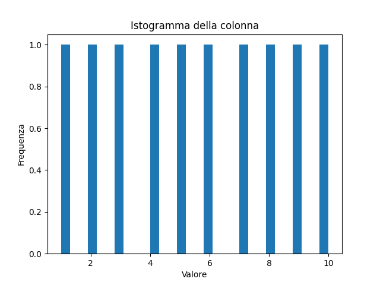
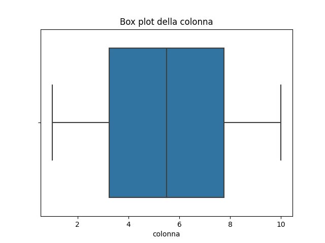
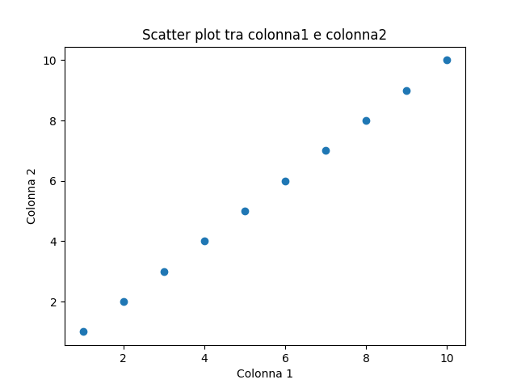

# EDA: Comprendere distribuzione e natura dei dati
Argomenti: distribuzioni, scatter plots, correlazioni, box plots, istogrammi.

## Intro

L'analisi esplorativa dei dati, comunemente nota come **EDA**, è una pratica fondamentale nel processo di analisi dei dati. Si tratta di esaminare e comprendere la struttura, le tendenze, le variazioni e le potenziali anomalie nei dati, prima di procedere con analisi più avanzate o modellizzazione. L'EDA aiuta a rivelare le storie nascoste dietro i dati e a prendere decisioni informate sulle prossime fasi dell'analisi.

## Distribuzioni

Gli **istogrammi** sono strumenti potenti per visualizzare la distribuzione dei dati:

```python
import matplotlib.pyplot as plt
import pandas as pd

data = pd.DataFrame({'colonna': [1, 2, 3, 4, 5, 6, 7, 8, 9, 10]})

plt.hist(data['colonna'], bins=30)
plt.title("Istogramma della colonna")
plt.xlabel("Valore")
plt.ylabel("Frequenza")
plt.show()
```

Come output avremo:



I **box plots** mostrano la mediana, i quartili e gli outlier dei dati:

```python
import matplotlib.pyplot as plt
import seaborn as sns

sns.boxplot(data=data, x='colonna')
plt.title("Box plot della colonna")
plt.show()
```
Come output avremo:



## Scatter plots e correlazioni

Lo **scatter plot** è ideale per visualizzare la relazione tra due variabili continue:

```python
import matplotlib.pyplot as plt
import seaborn as sns
import pandas as pd

data = pd.DataFrame({
    'colonna1': [1, 2, 3, 4, 5, 6, 7, 8, 9, 10],
    'colonna2': [1, 2, 3, 4, 5, 6, 7, 8, 9, 10]
})

plt.scatter(data['colonna1'], data['colonna2'])
plt.title("Scatter plot tra colonna1 e colonna2")
plt.xlabel("Colonna 1")
plt.ylabel("Colonna 2")
plt.show()
```

Come output avremo:



La correlazione quantifica la relazione lineare tra due variabili. Valori vicini a 1 o -1 indicano una forte correlazione positiva o negativa, rispettivamente:

```python
correlazione = data['colonna1'].corr(data['colonna2'])
```

:::caution attenzione 
Ricorda che l'EDA è una fase esplorativa. Il suo obiettivo principale è familiarizzare con i dati, piuttosto che trarre conclusioni definitive. Prendi nota delle tendenze e delle anomalie, ma procedi sempre con un'analisi approfondita prima di trarre conclusioni finali. 
:::

## Esercizi

1.  Crea un istogramma per una delle tue variabili e interpreta la sua forma: è simmetrica? Ha una coda lunga su un lato?
2.  Utilizza un box plot per identificare gli outlier in una variabile.
3.  Crea uno scatter plot per due variabili e cerca eventuali tendenze o pattern.
4.  Calcola il coefficiente di correlazione tra due variabili e rifletti sulla sua importanza.

Congratulazioni! 🎉

Hai appreso le basi dell'Analisi Esplorativa dei Dati, una componente essenziale nel mondo dell'analisi dei dati.