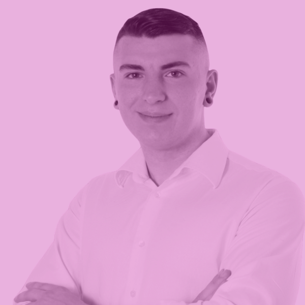
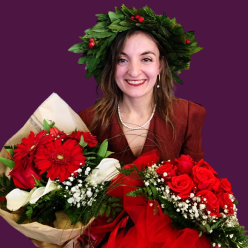
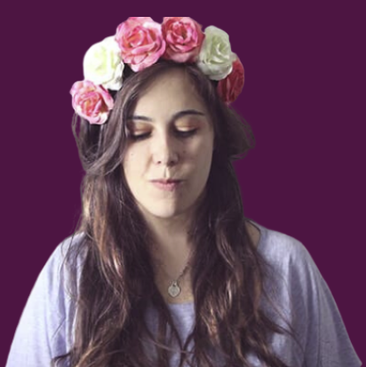
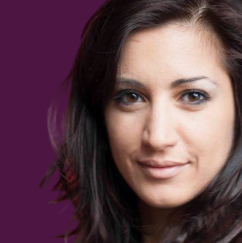

# Mentors

Mentor e mentee possono avere un legame molto importante e duraturo, anche dopo la conclusione del bootcamp. 
Cliccando sull'immagine di ogni mentor sarà possibile accedere al relativo profilo LinkedIn.

## Valentina Capradossi

## Marina Caporlingua

## Ludovico Besana

## Miriam Dessi

## Serena Sgrò

## Adriana Cano

## Carlotta Schezzini

## Anna Tripodi

## Sara Carlucci

