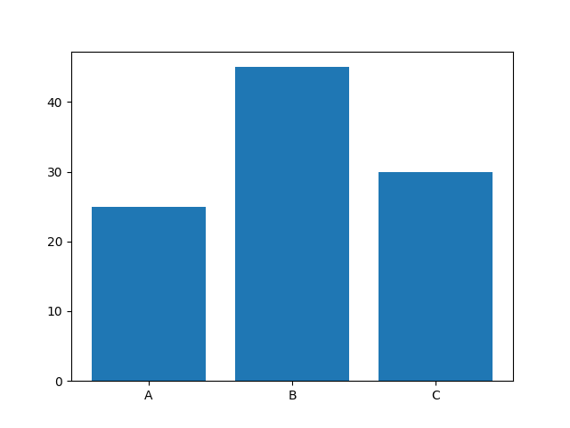
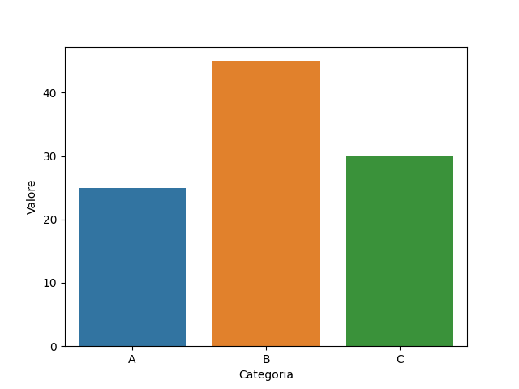
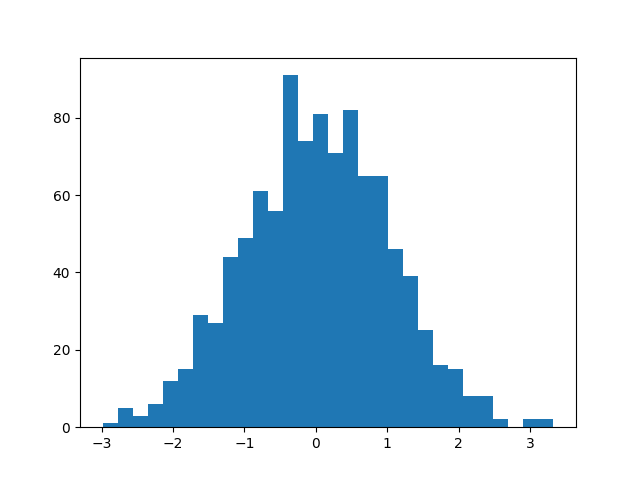
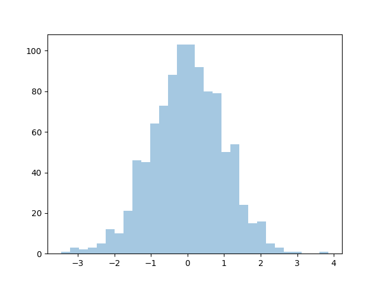
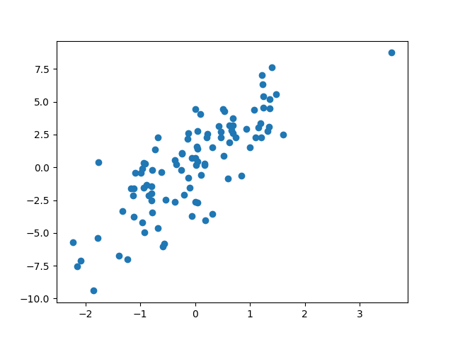
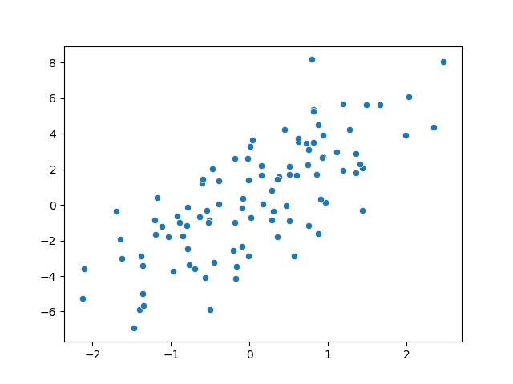

# Matplotlib e Seaborn: Grafici base
Argomenti: grafici a barre (`bar` e `barplot`), istogrammi (`hist` e `distplot`), scatter plot (`scatter` e `scatterplot`).

## Intro

La visualizzazione dei dati è un passo fondamentale nell'analisi dei dati. Fornisce una rappresentazione grafica delle informazioni, rendendo più facile individuare pattern, trend e anomalie. [Matplotlib](https://matplotlib.org/) e [Seaborn](https://seaborn.pydata.org/) sono due librerie Python molto popolari per la visualizzazione dei dati.

## Grafici a barre

Con Matplotlib:

```python
import matplotlib.pyplot as plt

data = {"A": 25, "B": 45, "C": 30}
plt.bar(data.keys(), data.values())
plt.show()
```

Come output avremo:



Con Seaborn:

```python
import numpy as np
import pandas as pd
import seaborn as sns
import matplotlib.pyplot as plt

data = {"A": 25, "B": 45, "C": 30}

df = pd.DataFrame({'Categoria': list(data.keys()), 'Valore': list(data.values())})
sns.barplot(x='Categoria', y='Valore', data=df)
plt.show()

```

Come output avremo:



## Istogrammi

Gli istogrammi mostrano la distribuzione di un set di dati continuo, suddividendo i dati in intervalli (o "bin") e rappresentando la frequenza dei dati in ogni intervallo.

Con Matplotlib:

```python
import numpy as np
import matplotlib.pyplot as plt
data = np.random.randn(1000)
plt.hist(data, bins=30)
plt.show()
```

Come output avremo:



Con Seaborn:

```python
import numpy as np
import seaborn as sns
import matplotlib.pyplot as plt
data = np.random.randn(1000)
sns.distplot(data, bins=30, kde=False)  # kde=False removes the kernel density estimate
plt.show()
```

Come output avremo:



## Scatter plot

Gli scatter plot sono utilizzati per mostrare la relazione tra due set di dati.

Con Matplotlib:

```python
import numpy as np
import seaborn as sns
import matplotlib.pyplot as plt

x = np.random.randn(100)
y = x * 3 + np.random.randn(100) * 2

plt.scatter(x, y)
plt.show()
```

Come output avremo:



Con Seaborn:

```python
import numpy as np
import seaborn as sns
import matplotlib.pyplot as plt

x = np.random.randn(100)
y = x * 3 + np.random.randn(100) * 2

sns.scatterplot(x=x, y=y)
plt.show()

```

Come output avremo:



:::caution attenzione 
L'overplotting (eccesso di punti sovrapposti) in uno scatter plot può rendere difficile interpretare i dati. Considera l'uso di trasparenza, dimensioni ridotte dei punti o tecniche di aggregazione per mitigare questo problema. 
:::

## Esercizi

1.  Crea un grafico a barre utilizzando sia Matplotlib che Seaborn. Prova a personalizzare l'aspetto del grafico (es. colori, titoli, etichette).
2.  Genera un set di dati randomico e crea un istogramma per visualizzarne la distribuzione.
3.  Utilizza uno scatter plot per esplorare la relazione tra due set di dati.

Congratulazioni! 🎉

Hai appreso come creare grafici di base con Matplotlib e Seaborn.