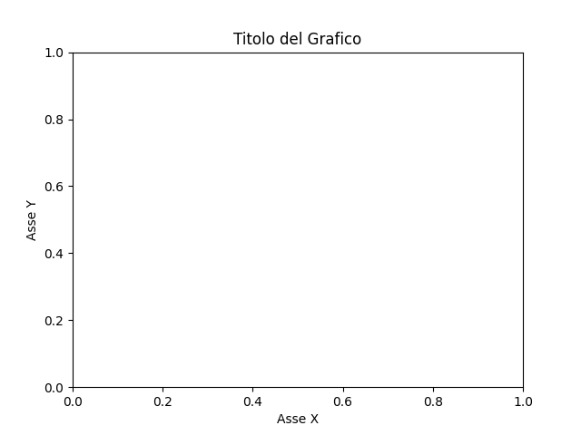
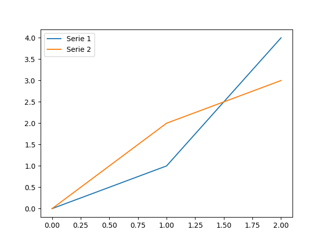
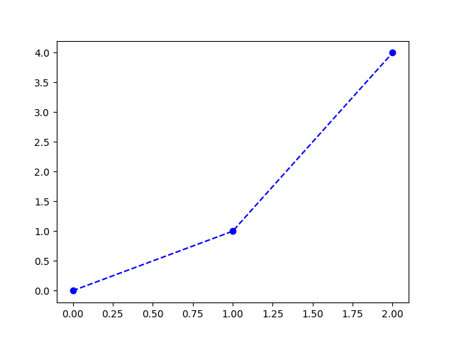

# Personalizzazione base dei grafici
Argomenti: titoli, etichette degli assi, legende, colori, stili.

## Intro

**La creazione di grafici comprensibili e gradevoli aiuta notevolmente nell'interpretazione e nella comunicazione dei dati.** Personalizzare i grafici ti permette di sottolineare gli aspetti importanti dei tuoi dati e rendere le visualizzazioni più chiare ed efficaci. Matplotlib e Seaborn offrono un'ampia gamma di opzioni per personalizzare l'aspetto e lo stile dei grafici.

## Titoli e etichette degli assi

Matplotlib:

```python
import matplotlib.pyplot as plt

plt.title("Titolo del Grafico")
plt.xlabel("Asse X")
plt.ylabel("Asse Y")
plt.show()
```

Come output avremo:



Seaborn: 

Seaborn si basa su Matplotlib, quindi per aggiungere titoli e etichette, puoi utilizzare le stesse funzioni di Matplotlib.

## Legende

Le legende aiutano a identificare le serie di dati all'interno di un grafico.

Matplotlib:

```python
plt.plot([0, 1, 2], [0, 1, 4], label="Serie 1")
plt.plot([0, 1, 2], [0, 2, 3], label="Serie 2")
plt.legend()
plt.show()
```

Come output avremo:



Seaborn: 

La maggior parte delle funzioni di Seaborn aggiungerà automaticamente una legenda se rileva più serie di dati. Puoi anche utilizzare `plt.legend()` per controllare l'aspetto e la posizione.

## Colori e stili

Matplotlib:

```python
import matplotlib.pyplot as plt

plt.plot([0, 1, 2], [0, 1, 4], color="blue", linestyle="--", marker="o")
plt.show()
```

Come output avremo:



Seaborn: Seaborn offre una serie di palette di colori predefinite che possono essere facilmente applicate ai grafici:

```python
import matplotlib.pyplot as plt
import seaborn as sns

sns.set_palette("husl")
sns.palplot(sns.color_palette("husl", 10))  
plt.show()
```

Come output avremo:


:::tip 
Con Seaborn, puoi utilizzare la funzione `sns.set_style()` per cambiare rapidamente lo stile di sfondo dei grafici, ad esempio "whitegrid", "darkgrid", "white", ecc. 
:::

Per maggiori palette e opzioni, consulta la [documentazione ufficiale](https://seaborn.pydata.org/tutorial/color_palettes.html).

:::caution attenzione 
Ricorda che la semplicità è spesso la chiave. Mentre Matplotlib e Seaborn offrono molte opzioni per la personalizzazione, l'obiettivo principale dovrebbe sempre essere la chiarezza e l'efficacia della comunicazione. 
:::

## Esercizi

1.  Crea un grafico di base e aggiungi un titolo, etichette per gli assi e una legenda.
2.  Esperimenta con diversi stili e colori, sia in Matplotlib che in Seaborn.
3.  Utilizza Seaborn per cambiare la palette di colori e lo stile di sfondo del tuo grafico.

Congratulazioni! 🎉

Hai appreso come personalizzare l'aspetto dei tuoi grafici con Matplotlib e Seaborn, rendendo le tue visualizzazioni più efficaci e gradevoli.