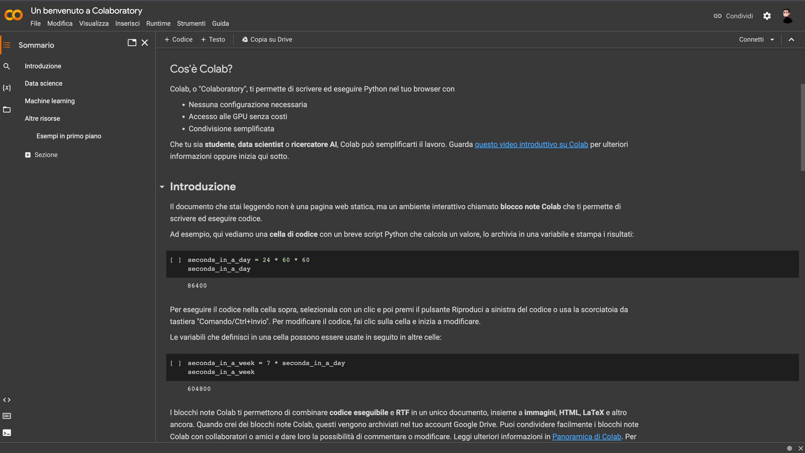

# Google Colab

**Google Colab** è uno strumento potente e flessibile per gli/le amanti di Python, che consente loro di scrivere, eseguire e testare il codice Python in un ambiente di sviluppo completo e isolato, direttamente dal browser.

## Per utilizzare Google Colab:

**Step 1:** Apri il tuo browser preferito e visita il sito web ufficiale di Google Colab all'indirizzo https://colab.research.google.com/.

**Step 2:** Clicca sul bottone "Nuovo blocco note" per creare un nuovo notebook Python.

**Step 3:** Ora sei nel notebook di Google Colab! Puoi iniziare a scrivere codice Python nelle celle del notebook. Per eseguire il codice in una cella, premi Shift+Invio.

**Step 4:** Puoi salvare il tuo notebook su Google Drive cliccando su "File" > "Save", o scaricarlo sul tuo computer locale come un file `.ipynb.`

Ben fatto! 🎉

Ora puoi iniziare ad utilizzare Google Colab.